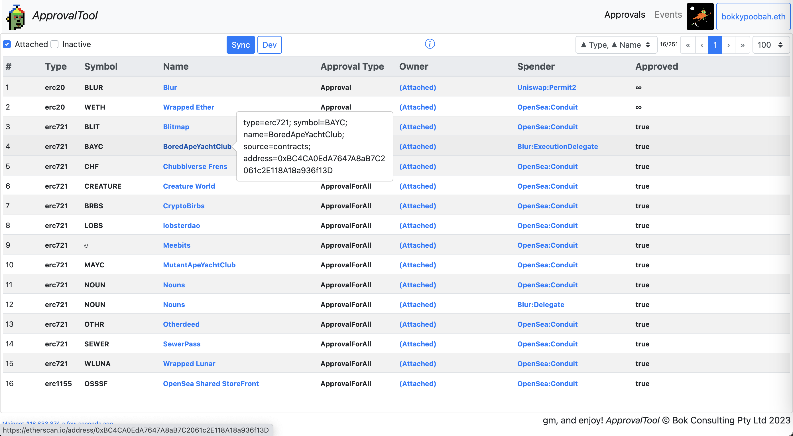
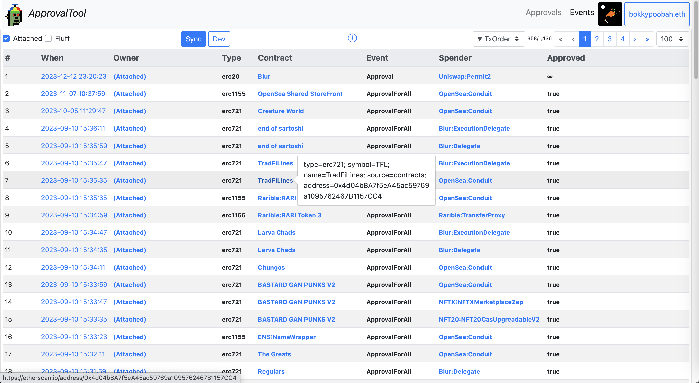
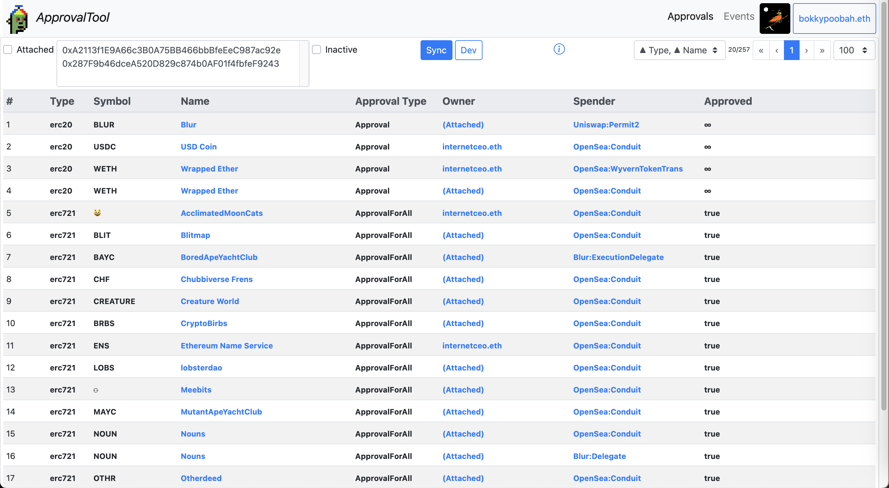
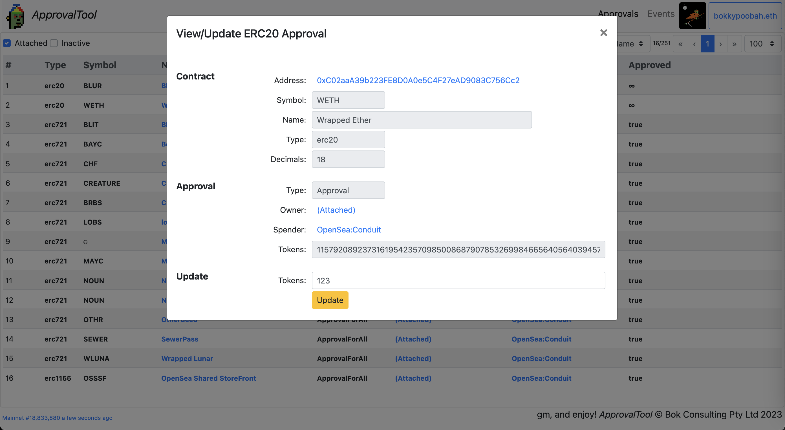
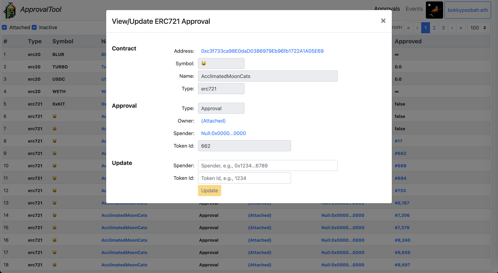
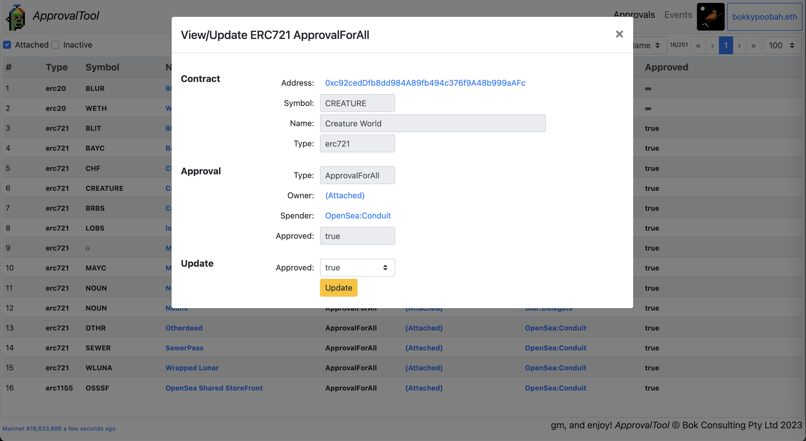
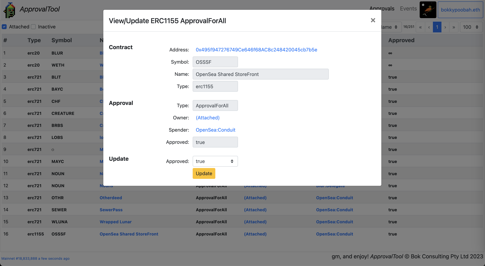

# ApprovalTool

A lightweigh web3 dapp tool to manage your approvals for ERC-20, ERC-721 and ERC-1155 token contracts.

URL: [https://bokkypoobah.github.io/ApprovalTool/](https://bokkypoobah.github.io/ApprovalTool/)

 

---

### How This Works

* This tool scans for [ERC-20](https://eips.ethereum.org/EIPS/eip-20#events), [ERC-721](https://eips.ethereum.org/EIPS/eip-721#specification) and [ERC-1155](https://eips.ethereum.org/EIPS/eip-1155#specification) *Approval* and *ApprovalForAll* log events from the owner's account. This is done using the [getLogs(filter)](https://docs.ethers.org/v5/api/providers/provider/#Provider-getLogs) web3 call.
* These event logs are then processed to determine the approval states for the various ERC-20, ERC-721 and ERC-1155 contracts
* The latest ERC-20 approval amounts are retrieved using the ERC-20 `allowance(...)` function
* ~~This tool retrieves block timestamps from [https://api.thegraph.com/subgraphs/name/blocklytics/ethereum-blocks](https://api.thegraph.com/subgraphs/name/blocklytics/ethereum-blocks)~~

 

---

### Requirements

* This dapp runs in web3 enabled desktop browsers connected to the Ethereum mainnet

 

---

### References

* Dapp: [https://bokkypoobah.github.io/ApprovalTool/](https://bokkypoobah.github.io/ApprovalTool/)
* GitHub: [https://github.com/bokkypoobah/ApprovalTool](https://github.com/bokkypoobah/ApprovalTool)
* Main Dapp Source Code: [https://github.com/bokkypoobah/ApprovalTool/blob/main/docs/index.html](https://github.com/bokkypoobah/ApprovalTool/blob/main/docs/index.html)

 

---

### Running Locally

* In a folder on your computer, **git clone [https://github.com/bokkypoobah/ApprovalTool](https://github.com/bokkypoobah/ApprovalTool)**
* Run a tool like [anywhere](https://www.npmjs.com/package/anywhere) in the ./docs subdirectory of the folder created above

 

---

### Design

* This dapp is designed to have minimal external dependencies - all code is statically served from GitHub
* No backend servers are necessary, only a web3 connection
* Block timestamps are retrieved from TheGraph for speed - this can be replaced with slower calls to **getBlock({blockNumber}).timestamp**

 

---

### Sample Screens

#### Sample Approvals Screen - Attached Account

<kbd></kbd>

#### Sample Events Screen - Attached Account

<kbd></kbd>

#### Sample Events Screen - Specified Accounts

<kbd></kbd>

#### Sample ERC-20 Approval Screen

<kbd></kbd>

#### Sample ERC-721 Approval Screen

<kbd></kbd>

#### Sample ERC-721 ApprovalForAll Screen

<kbd></kbd>

#### Sample ERC-1155 ApprovalForAll Screen

<kbd></kbd>

 

 

Enjoy!

(c) BokkyPooBah / Bok Consulting Pty Ltd 2023. The MIT Licence.
