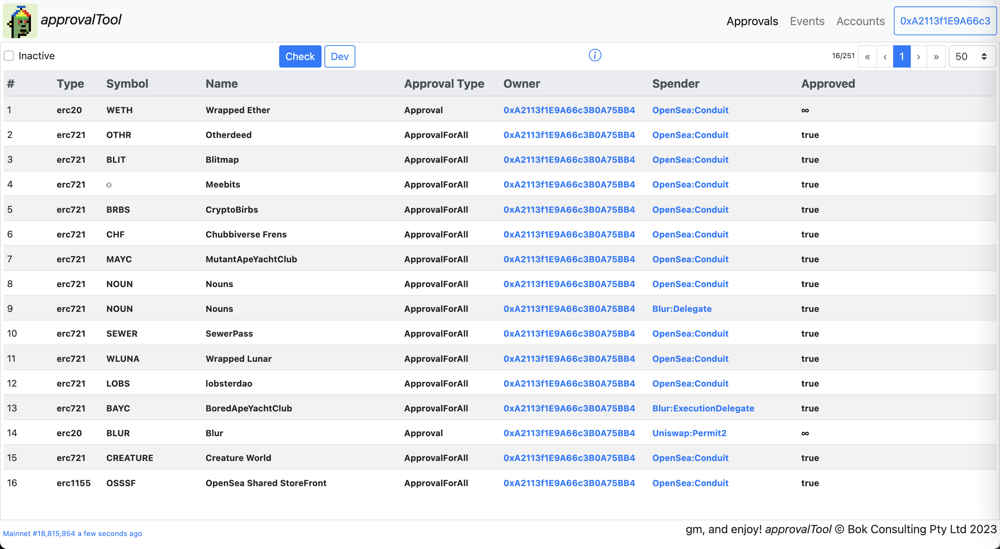
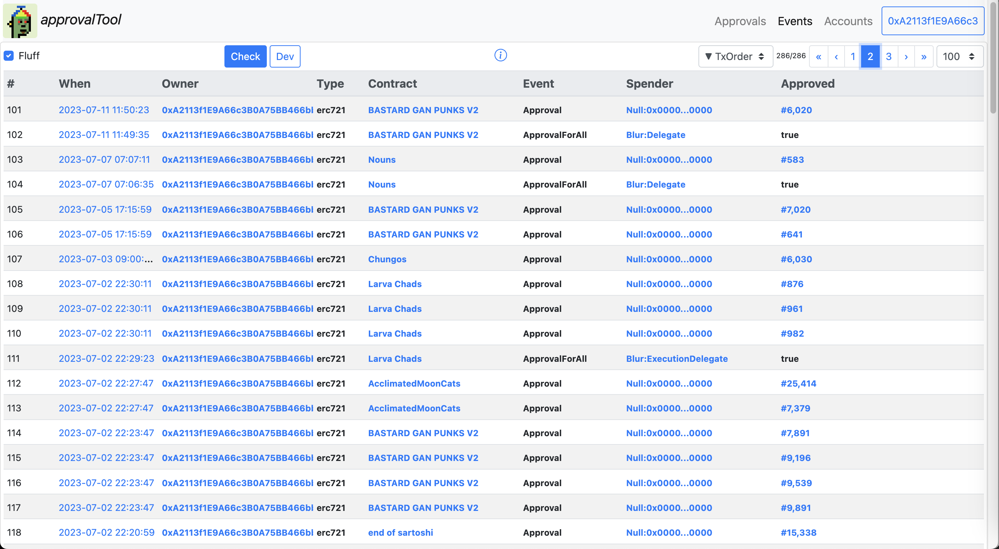
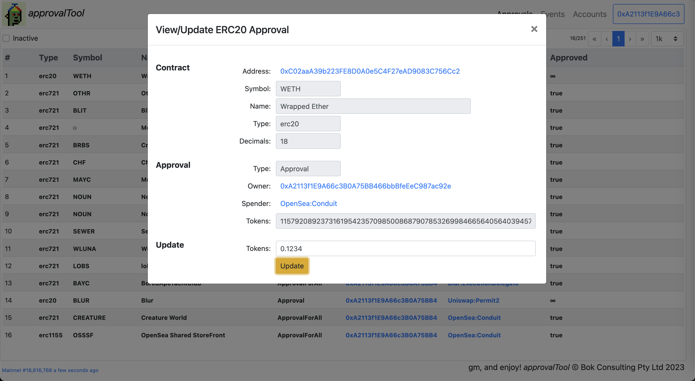
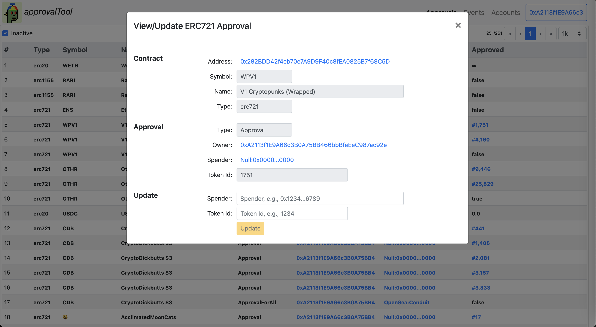
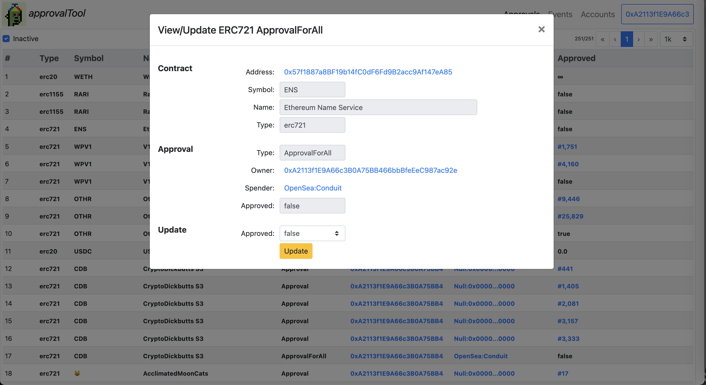
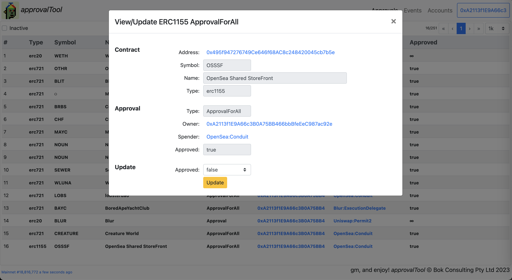

# ApprovalTool
Lightweigh web3 dapp tool to manage your approvals for ERC-20, ERC-721 and ERC-1155 contracts.

 

---

### How This Works

* This tool scans for ERC-20, ERC-721 and ERC-1155 *Approval* and *ApprovalForAll* log events with the first parameter being the owner account being searched for. This is done using the `getFilter(...)` web3 call.
* These event logs are process to determine the approval states for the various ERC-20, ERC-721 and ERC-1155 contracts
* Aside from the web3 call to retrieve log events, this tool retrieves block timestamps from [https://api.thegraph.com/subgraphs/name/blocklytics/ethereum-blocks](https://api.thegraph.com/subgraphs/name/blocklytics/ethereum-blocks)

 

---

### Running This Dapp

* Run directly from [https://bokkypoobah.github.io/ApprovalTool/](https://bokkypoobah.github.io/ApprovalTool/)
* Fork [https://github.com/bokkypoobah/ApprovalTool](https://github.com/bokkypoobah/ApprovalTool) and set up your own GitHub Pages
* Clone [https://github.com/bokkypoobah/ApprovalTool](https://github.com/bokkypoobah/ApprovalTool) on your local computer and run using, e.g., [anywhere](https://www.npmjs.com/package/anywhere) in the ./docs folder

 

---

### Sample Screens

#### Sample Approvals Screen

<kbd></kbd>

#### Sample Events Screen

<kbd></kbd>

#### Sample ERC-20 Approval Screen

<kbd></kbd>

#### Sample ERC-721 Approval Screen

<kbd></kbd>

#### Sample ERC-721 ApprovalForAll Screen

<kbd></kbd>

#### Sample ERC-1155 ApprovalForAll Screen

<kbd></kbd>

 

 

Enjoy!

(c) BokkyPooBah / Bok Consulting Pty Ltd 2023. The MIT Licence.
